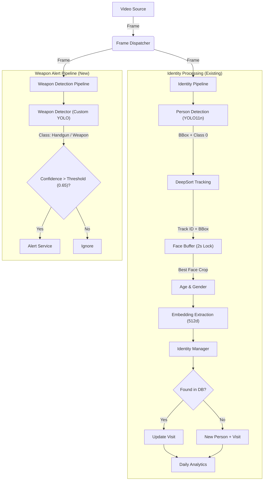

```mermaid

    graph TD

        A["Video Source"] -->|Frame| B("Frame Dispatcher")

        %% Frame Fan-Out
        B -->|"Frame"| C["Identity Pipeline"]
        B -->|"Frame"| W["Weapon Detection Pipeline"]

        %% =========================
        %% Identity Pipeline
        %% =========================
        subgraph "Identity Processing (Existing)"
            C --> D["Person Detection (YOLO11n)"]
            D -->|"BBox + Class 0"| E["DeepSort Tracking"]
            E -->|"Track ID + BBox"| F["Face Buffer (2s Lock)"]
            F -->|"Best Face Crop"| G1["Age & Gender"]
            G1 --> G2["Embedding Extraction (512d)"]
            G2 --> H["Identity Manager"]
            H --> I{"Found in DB?"}
            I -->|"Yes"| J["Update Visit"]
            I -->|"No"| K["New Person + Visit"]
            J --> L["Daily Analytics"]
            K --> L
        end

        %% =========================
        %% Weapon Pipeline
        %% =========================
        subgraph "Weapon Alert Pipeline (New)"
            W --> M["Weapon Detector (Custom YOLO)"]
            M -->|"Class: Handgun / Weapon"| N{"Confidence > Threshold (0.65)?"}
            N -->|"Yes"| O["Alert Service"]
            N -->|"No"| P["Ignore"]
        end

```