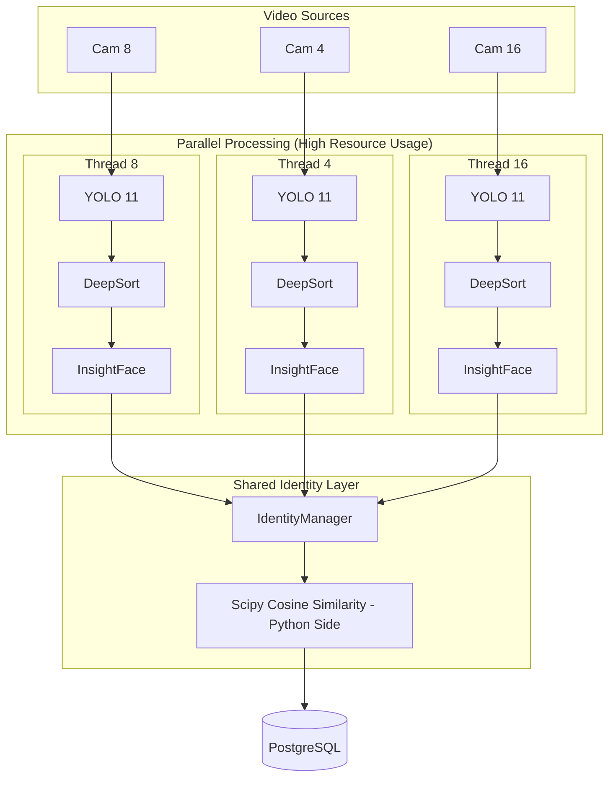

# Architecture Documentation (Current vs. Target)

## 1. Current Workflow (The "3 Frame" Logic)
Each channel (8, 4, 16) operates in a siloed thread but shares a database.

## 2. Why they "catch" people differently
*   **Spatial Coverage:** Each camera sees a different zone.
*   **Independent Tracking:** A "Track ID" is local to a camera. Track #1 on Cam 8 is NOT the same as Track #1 on Cam 4.
*   **Global Resolution:** They only "become the same person" once the Face Embedding is extracted and matched in the `IdentityManager`.

## 3. Required Changes (The "To-Do" List)

| Feature | Current State | Target State |
| :--- | :--- | :--- |
| **Face Search** | Linear scan in Python (Slow) | `pgvector` similarity search in SQL (Fast) |
| **Model Memory** | 3x instances of YOLO/Face Models | Shared Model Pool or Singleton |
| **Handover** | Purely face-based | Spatio-temporal logic (if Cam 8 sees exit, expect Cam 4 entry) |
| **Database** | Synchronous writes (blocks video) | Background task / Queue for DB logs |

## 4. Next Step: pgvector Implementation
The most critical change is moving `app/services/identity_manager.py` away from `scipy.spatial.distance.cosine` and using `vector <=> embedding` in the SQL query.
