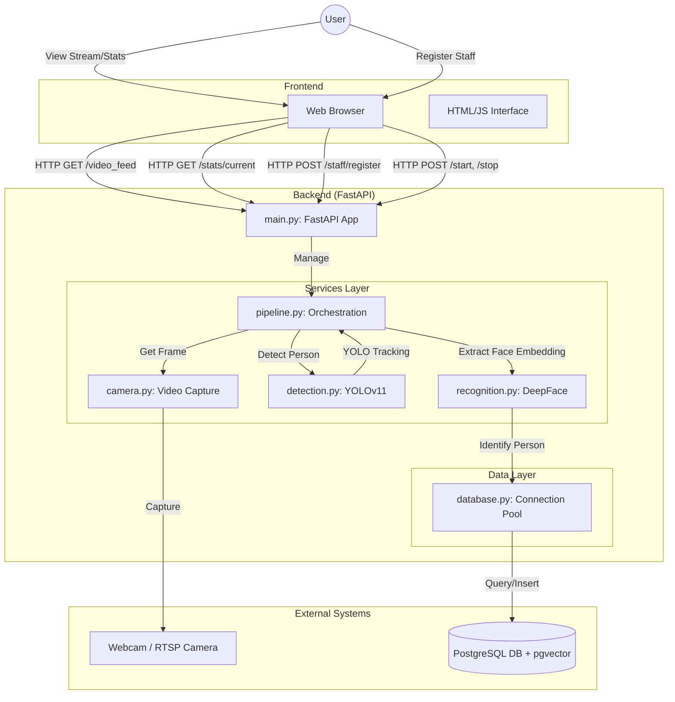

# System Architecture

## Component Description

### Frontend
- **HTML/JS Interface**: Located in `app/templates/index.html`. Connects to the backend via REST APIs and displays the MJPEG video stream.

### Backend (FastAPI)
- **`main.py`**: The entry point. Handles HTTP requests, streaming responses, and lifecycle events (startup/shutdown).
- **`pipeline.py`**: The core logic. Orchestrates the flow of data:
    1.  Gets frame from `CameraService`.
    2.  Sends frame to `DetectionService` to find people.
    3.  For each person, extracts a face crop.
    4.  Sends face crop to `RecognitionService` to get an embedding.
    5.  Matches embedding against the database.
    6.  Annotates frame and updates statistics.

### Services
- **`camera.py`**: Manages the video source (Webcam or RTSP). Handles reconnection logic.
- **`detection.py`**: Wraps the YOLOv11 model (`ultralytics`) for person detection and tracking (ByteTrack).
- **`recognition.py`**: Wraps `DeepFace` for generating face embeddings (Facenet512) and interacts with the database to find matches using vector similarity.

### Data Layer
- **`database.py`**: Manages PostgreSQL connection pooling (`psycopg2`).
- **PostgreSQL**: Stores staff profiles (with embeddings) and detection logs. Uses `pgvector` for efficient similarity search.
